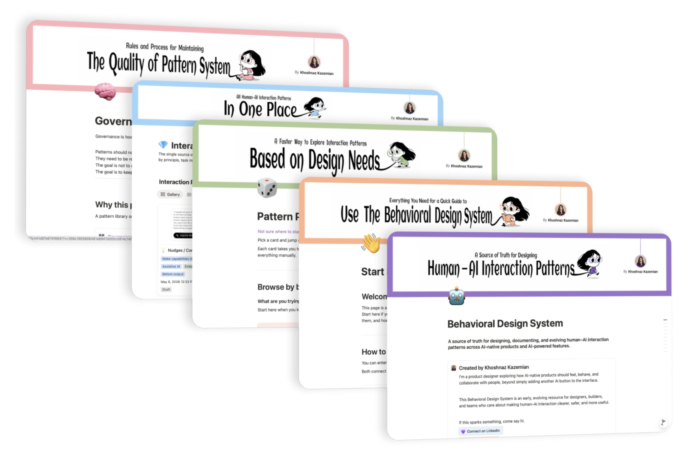

# Behavioral Design System Starter Kit

Design reusable human–AI collaboration patterns before UI decisions.

**Version:** v0.1 · **License:** [MIT](LICENSE)

<a href="https://www.notion.so/Behavioral-Design-System-353c19558084817fb724ef994f871030">
  
</a>

<p align="center">
  <a href="https://www.notion.so/Behavioral-Design-System-353c19558084817fb724ef994f871030">
    Open the full Behavioral Design System in Notion →
  </a>
</p>

AI products introduced a new design problem.

Most teams already have systems for interface consistency:
components, tokens, layouts, accessibility, visual states.

But many AI decisions happen before the interface even exists:

- Should the AI suggest, ask, or act?
- When should humans approve?
- How should uncertainty appear?
- What happens if AI is wrong?
- Who owns the final decision?

These decisions often get redesigned feature by feature.

This starter kit explores another approach:

→ document and reuse **human–AI interaction patterns** as a source of truth.

---

## Learn More

- **[Full Behavioral Design System (Notion)](https://www.notion.so/Behavioral-Design-System-353c19558084817fb724ef994f871030)** — A visual, browsable version of the system including pattern structure, governance, and examples.
- **[Read the story behind it (Substack)](https://substack.com/home/post/p-196889764)** — *I Started Building the Missing Layer in AI-Native Product Design* — a deeper explanation of the missing behavior layer in AI-native feature design.

---

## Requirements

- **[Cursor](https://cursor.com)** with **Agent** mode (the unpacker is a Cursor Agent skill)
- A rough AI feature idea, notes, or early concept to unpack

---

## What this starter kit helps you do

Move from:

Messy AI feature idea  
→ Reusable interaction pattern  
→ Structured documentation  
→ Team source of truth

This repository includes:

### `skills/ai-feature-unpacker/`

Transforms rough AI feature ideas into reusable human–AI interaction patterns.

The skill:

- helps narrow broad features into specific reusable patterns
- asks thoughtful clarification questions
- reduces hallucinated documentation
- classifies patterns using Behavioral Design System DNA
- generates clean documentation

---

### `behavioral-dna/`

Behavioral Design System classification framework (the DNA lenses for each pattern).

Files:

- `behavioral-dna/behavior-principles.md`
- `behavioral-dna/collaboration-models.md`
- `behavioral-dna/task-moments.md`
- `behavioral-dna/surfaces.md`

These files define how patterns are classified.

---

### `templates/interaction-pattern-template.md`

Reusable pattern documentation structure.

Use this template to:

- document patterns consistently
- prepare patterns for Notion or Confluence
- maintain a clean source of truth

---

### `outputs/generated-patterns/`

Generated pattern documentation lives here.

Review and iterate before publishing.

---

### `publishing-guides/`

Optional publishing workflows.

Files:

- `publishing-guides/notion.md`
- `publishing-guides/confluence.md`

Use these only after the documentation is reviewed.

---

## Repository Structure

```plaintext
behavioral-design-system-starter-kit/

assets/
└── behavioral-design-system-cover.png

skills/
└── ai-feature-unpacker/
    └── SKILL.md

behavioral-dna/
├── behavior-principles.md
├── collaboration-models.md
├── task-moments.md
└── surfaces.md

templates/
└── interaction-pattern-template.md

outputs/
└── generated-patterns/

publishing-guides/
├── notion.md
└── confluence.md
```

---

## Quick Start

### 1. Clone and open in Cursor

```bash
git clone <your-repo-url>
cd behavioral-design-system-starter-kit
```

Open the folder in Cursor.


---

### 2. Start with a rough AI feature idea

Example:

Engineer writes a prompt → AI generates a workflow.

Paste your notes, PRD fragment, or feature description into **Agent** chat.

---

### 3. Run the unpacker

In Agent chat, ask to use the **AI Feature Unpacker** skill (or reference `skills/ai-feature-unpacker/SKILL.md`).

Example prompt:

> Use the AI Feature Unpacker skill to turn this into one reusable interaction pattern: [your idea]

The skill will:

- identify candidate interaction patterns
- help you think through missing decisions
- classify the pattern using `behavioral-dna/`
- document one reusable pattern using `templates/interaction-pattern-template.md`

**Output:** a Markdown file in `outputs/generated-patterns/`

---

### 4. Review and iterate

Keep refining until the pattern feels reusable.

---

### 5. Publish (optional)

Move the final Markdown file into:

- Notion
- Confluence
- your documentation system

using:

`publishing-guides/`

---

## Principles

This project intentionally prefers:

- behavior before interface
- reusable decisions before isolated features
- documentation over scattered knowledge
- human judgment over automation
- source of truth over generated noise

---

## Current Status

Early public version (v0.1).

Patterns, classifications, and workflows are evolving and intended to improve through use and feedback.

---

## Author

**Khoshnaz Kazemian** — [LinkedIn](https://www.linkedin.com/in/khoshnaz-kazemian-32785a152/) · [khoshnazdesign.com](https://khoshnazdesign.com)

## License

This project is licensed under the [MIT License](LICENSE).
